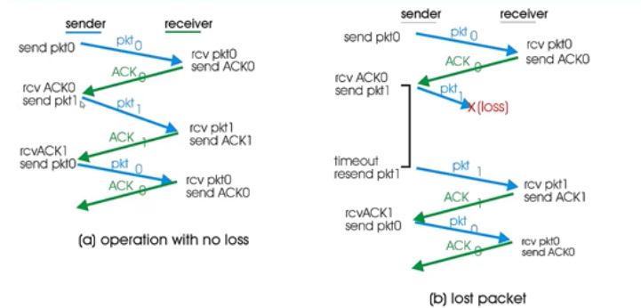
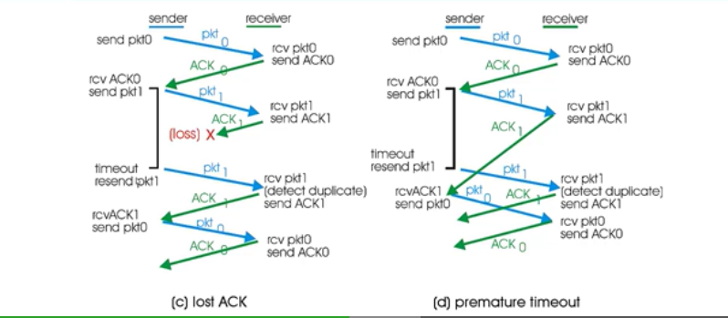
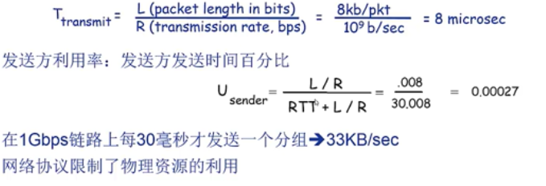

# RDT3.0

如果信道即可能发生错误(在RDT3.0前默认是分组都一定到达)，也可能发生分组丢失怎么办

- checksum + serialize + ACK + 重传 够用吗

方法：发送方等待合理的时间
- 如果没有收到ACK，重传
- 如果分组或ACK只是延迟而不是丢了
    - 重传会产生重复，序列号机制可以处理
    - 接收方需要在ACK中显示告知所确认的分组
- 需要定时器

## RDT3.0状态机

工作示例

  
## RDT3.0性能分析
RDT3.0可以正确工作，但是性能很差
- 示例：假设有1Gbps链路，15ms端到端传播延迟，1KB分组

本质上性能差的原因就是因为停-等操作，