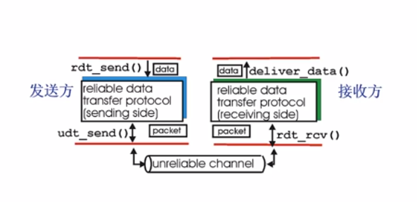
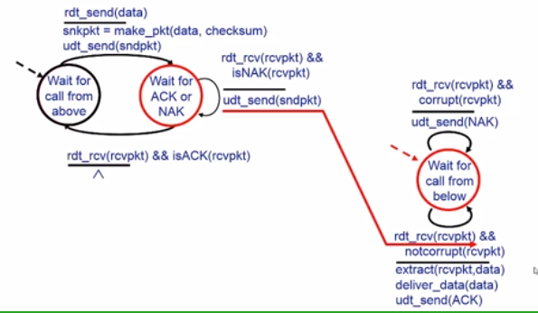

# 可靠数据传输的原理

什么是可靠
- 不错，不丢，不乱

可靠数据传输协议
- 可靠数据传输对应用层，传输层，链路层丢很重要。
- 网络Top-10问题
- 信道的不可靠特性决定了可靠数据传输(RDT)的复杂性

可靠数据传输协议基本结构：接口

传输层向下依靠的又是不可靠的channel

## 可靠数据传输协议
- 渐进的设计可靠数据传输协议的发送方和接收方
- 只考虑单项数据传输
    - 但控制信息双向流动
- 利用状态机刻画传输协议(有限状态自动机)

## RDT1.0: 可靠信道上的可靠数据传输(理想信道)
- 底层信道完全可靠
    - 不会发生错误(bit error)
    - 不会丢弃分组
- 发送方与接收方的状态机独立

## RDT2.0: 只可能产生位错误的信道上的可靠数据传输
发生错误
- 底层信道可能反转分组中的位(bit)
    - 利用校验和检测位错误

如何从错误中恢复？
- 确认机制(ACK acknowledgements): 接收方显式的告知发送方分组已经正确接收
- NAK(Negative acknowledgements)：显式告知发送方分组有错误
- 发送方收到NAK后，重传分组

基于这种重传机制的rdt协议称为ARQ(Automic repeat request)协议

RDT 2.0 中引入的新机制
- 差错检测(差错检验)
- 接收方反馈控制消息：ACK/NAK
- 重传

怎么设计(有限状态自动机)
- 发送方
    - 状态1：等待应用层发送数据
    - 状态2：等待返回ACK或NAK
- 接收方
    - 状态1：等待下层调用，通过发过来的checksum校验，抛弃数据并发送NAK或处理数据并交付给上层并发送ACK

