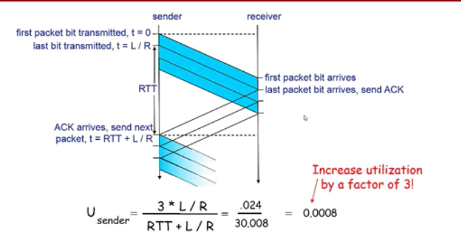
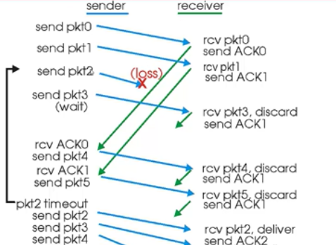
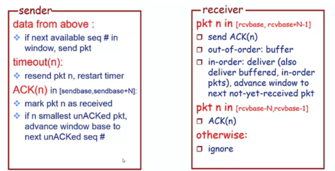
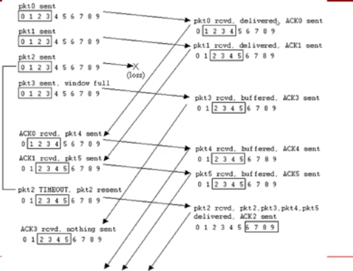
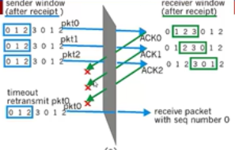

# 流水线机制和滑动窗口协议
之前说RDT3.0的性能低的原因就是停-等这一操作影响的(在程序里可以理解为堵塞的)，那么解决这样的程序性能低的办法无非就是异步。

## 流水线机制——提高网络资源利用率

## 流水线协议
- 允许发送方在收到ACK之前连续发送多个分组
    - 更大的序列号范围
    - 发送方与接收方需要更大的存储空间来缓存分组

## 滑动窗口协议——Sliding-window-protocol
窗口
- 允许使用的序列号范围
- 窗口尺寸为N：最多有N个等待确认的消息

滑动窗口
- 随着协议的运行，窗口在序列号空间内**向前滑动**

序列中有四种状态，四种状态的位置又可以分两种
- 窗口内
    - 已发送但是未收到ACK的序列号
    - 还可以使用的序列号
- 窗口外
    - 已成功收到ACK的序列号
    - 未被使用的序列号

滑动窗口协议
- GBN（Go back to N）
- SR（Select repeat）

## GBN协议
发送方
- 分组头部包含k-bit序列号
- 窗口尺寸为N，最多允许N个分组未确认
- ACK(n)：确认到序列号n(包含n)的分组均已被正确接收(累计确认机制)
    - 可能会收到重复ACK
    - 为传输中的分组设置计时器
- 超时Timeout(n)事件：重传序列号大于等于n，还未收到ACK的所有分组(可能造成潜在的资源浪费)

接收方
- 发送拥有最高序列号，已被正确接收的ACK
    - 可能产生重复的ACK
    - 只需要记住唯一的序列号
- 乱序到达的分组
    - 直接丢弃->接收方没有缓存  
    - 重新确认序列号最大的按需到达的分组

示例

## SR协议——Selective Repeat协议
GBN协议有什么缺陷
- Timeout(n)导致大量冗余重传

SR协议特点
- 接收方对每个分组单独进行确认
    - 设置缓存机制，缓存乱序到达的分组，序列号连续后交付给上层
- 发送方只重传那些没收到ACK的分组
    - 为每个分组设置定时器
- 发送方窗口
    - N个连续的序列号
    - 限制已发送且未确认的分组
- 接收方窗口
    - 窗口内
        - 乱序到达但是已经ACK了的
        - 还没有ACK的
        - 可以使用的ACK
    - 窗口外
        - 未使用的

示例

## SR协议：困境
- ACK都没到达

- 发送方接收ACK后，发送失败后，未收到ACK，即发送下一个
![])(static/14.png)

原因
序列号比较少，而窗口长度N又比较长

问题：序列号空间大小和窗口尺寸需要满足什么关系？
